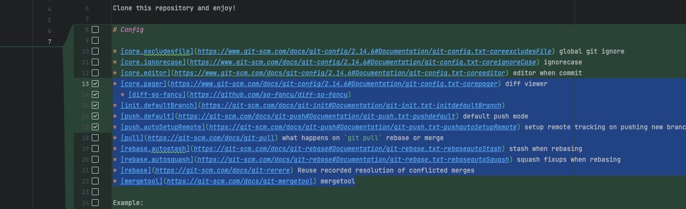

# Git Workshop
### by Stjepan Hadjić

Read this readme carefully before we start.

Clone this repository and enjoy!

# Config

* [core.excludesfile](https://www.git-scm.com/docs/git-config/2.14.6#Documentation/git-config.txt-coreexcludesFile) global git ignore
* [core.ignorecase](https://www.git-scm.com/docs/git-config/2.14.6#Documentation/git-config.txt-coreignoreCase) ignorecase
* [core.editor](https://www.git-scm.com/docs/git-config/2.14.6#Documentation/git-config.txt-coreeditor) editor when commit
* [core.pager](https://www.git-scm.com/docs/git-config/2.14.6#Documentation/git-config.txt-corepager) diff viewer
  * [diff-so-fancy](https://github.com/so-fancy/diff-so-fancy)
* [init.defaultBranch](https://git-scm.com/docs/git-init#Documentation/git-init.txt-initdefaultBranch)
* [push.default](https://git-scm.com/docs/git-push#Documentation/git-push.txt-pushdefault) default push mode
* [push.autoSetupRemote](https://git-scm.com/docs/git-push#Documentation/git-push.txt-pushautoSetupRemote) setup remote tracking on pushing new branch
* [pull](https://git-scm.com/docs/git-pull) what happens on `git pull` rebase or merge
* [rebase.autostash](https://git-scm.com/docs/git-rebase#Documentation/git-rebase.txt-rebaseautoStash) stash when rebasing
* [rebase.autosquash](https://git-scm.com/docs/git-rebase#Documentation/git-rebase.txt-rebaseautoSquash) squash fixups when rebasing
* [rebase](https://git-scm.com/docs/git-rerere) Reuse recorded resolution of conflicted merges
* [mergetool](https://git-scm.com/docs/git-mergetool) mergetool

Example:

```gitconfig
; ~/.gitconfig
[core]
  excludesfile = /Users/stef/.gitignore
  editor = nvim
  ; editor = code -w
  ; editor = atom -w
  ignorecase = false
  pager = diff-so-fancy | less --tabs=4 -RFX
[init]
  defaultBranch = master
[push]
  default = current
  autoSetupRemote = true
[pull]
  rebase = true
[rebase]
  autoStash = true
  autosquash = true
[rerere]
  enabled = true
```

# Aliases
* [Oh-My-Zsh](https://github.com/ohmyzsh/ohmyzsh/blob/master/plugins/git/git.plugin.zsh)
* [Prezto](https://github.com/sorin-ionescu/prezto/blob/master/modules/git/alias.zsh)

# Log

[git-log](https://git-scm.com/docs/git-log)

    $ git log --topo-order
    $ git log --topo-order --stat --patch --full-diff
    $ git log --topo-order --graph

# Task

Task instructions: [task.md](task.md)

# Stage hunks/lines

## In terminal
* [In terminal](https://git-scm.com/book/en/v2/Git-Tools-Interactive-Staging)

## In VScode


## In Intellij


# Push

To push current branch to remote and setup upstream tracking:

Without config

    $ git push --set-upstream origin feature_branch

with `push.default = current`

    $ git push --set-upstream

with `push.default = current` and `push.autoSetupRemote = true`

    $ git push

# Pull

* runs `git fetch`
* if current branch is behind remote, it will `fast-forward`
* if branches are diverged, it will `rebase` or `merge` depending on config

### [merge vs rebase](https://medium.com/pranayaggarwal25/git-merge-rebase-d8b91825bbb1)

## Merge


## Squash and merge (github)


## Fast-forward


## Rebase


# Rebase

    $ git rebase --interactive {commit/branch}
    $ git rebase --abort
    $ git rebase --continue
    $ git rebase --skip

# Merge Conflics

* Terminal


    $ git mergetool

* [VScore](https://code.visualstudio.com/docs/sourcecontrol/overview#_merge-conflicts)
* [IntelliJ](https://www.jetbrains.com/help/idea/resolve-conflicts.html)

# Additional

    $ git reflog

[LazyGit](https://github.com/jesseduffield/lazygit)
[Sign with 1password](https://blog.1password.com/git-commit-signing/)
